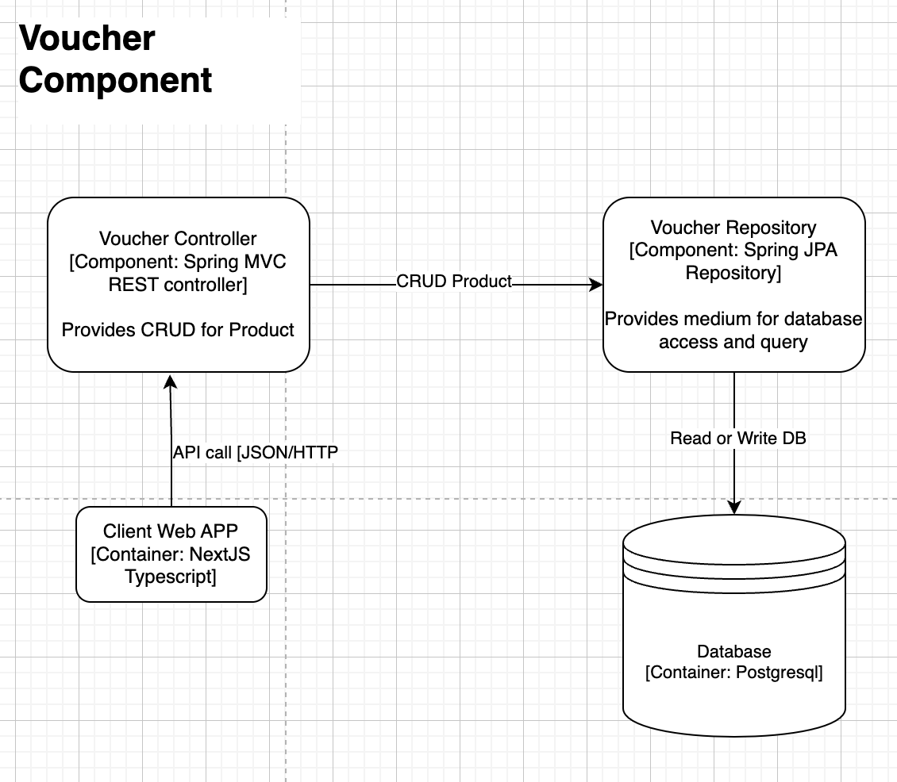

Component Diagram

# Voucher Microservice

Voucher Microservice adalah komponen dalam arsitektur mikroservice yang menyediakan fitur CRUD untuk voucher. Layanan ini dibangun menggunakan Spring Boot dan berinteraksi dengan database PostgreSQL untuk menyimpan data voucher. Selain itu, microservice ini dapat diakses melalui aplikasi web berbasis NextJS.

## Arsitektur Komponen

### Komponen-Komponen

1. **Client Web APP [Container: NextJS Typescript]**
    - Aplikasi web yang berfungsi sebagai antarmuka pengguna. Pengguna dapat mengirimkan permintaan API untuk melakukan operasi CRUD pada voucher.
    - Mengirim permintaan API (JSON/HTTP) ke `Voucher Controller`.

2. **Voucher Controller [Component: Spring MVC REST controller]**
    - Komponen yang menerima permintaan API dari aplikasi web.
    - Menyediakan endpoint REST untuk melakukan operasi CRUD pada voucher.
    - Menggunakan `Voucher Service` untuk memproses logika bisnis dan mengakses database.

3. **Voucher Service [Component: Spring Service]**
    - Mengandung logika bisnis untuk memproses permintaan CRUD.
    - Menggunakan `Voucher Repository` untuk berinteraksi dengan database.

4. **Voucher Repository [Component: Spring JPA Repository]**
    - Komponen yang menyediakan akses ke database.
    - Menggunakan Spring Data JPA untuk melakukan operasi CRUD pada database PostgreSQL.

5. **Database [Container: PostgreSQL]**
    - Database relasional yang menyimpan data voucher.
    - Diakses oleh `Voucher Repository` untuk membaca dan menulis data.

## Fitur Utama

1. **Concurrency**
    - Menggunakan Optimistic Locking pada entitas `Voucher` untuk menangani akses data secara konkuren.

2. **Asynchronous Processing**
    - Menggunakan anotasi `@Async` pada metode yang memerlukan pemrosesan asynchronous untuk meningkatkan kinerja.

3. **High-Level Networking**
    - Menggunakan `WebClient` untuk berkomunikasi dengan microservices lain, seperti microservice pengguna, untuk mendapatkan informasi tambahan.

4. **Message Queue Integration**
    - Mengintegrasikan RabbitMQ untuk mendukung pemrosesan asynchronous yang andal, meningkatkan scalability, dan mendekopling mikroservice.